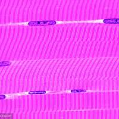

## 第 1 课：骨骼（1）

骨骼的作用主要是支撑身体。骨头给我们搭个架子，骨头与骨头之间，就是关节，那么肌肉跨越关节附着在骨头上，肌肉一收缩，人就能动弹。简单来说就是这样。

**骨头不止是钙 磷之类的矿物质，骨头里的这些矿物质，是附着在“蛋白质基质”上的（主要是胶原蛋白和黏蛋白）。骨头也在不断地破坏和更新当中，代谢很旺盛。**

从骨头的蛋白质基质角度说，需要注重两种营养：

**一是蛋白质，二是维生素C。**

维生素C，是合成胶原蛋白必须的一种东西。所以对谷歌胶原蛋白基质的合成很重要。当然，关于维生素C和骨骼健康的研究结论，也不是非常一致。有些研究发现，维生素C摄入不足，会影响骨骼健康，多吃点有好处。有些研究也没有发现有什么相关性。但是充足的维生素C，只要不过量，也没有坏处，起码从抗氧化的角度也是这样。

## 第 2 课：骨骼（2）

**骨头里的矿物质，主要是一种磷灰石晶体构成。对磷灰石晶体施加压力时，会由于一种“压电效应”产生微电流。所以我们对骨头施加压力的时候，也会产生微电流，这种微电流可以刺激骨骼矿化。所以力量训练有助于骨骼“变硬”。**

所以通俗地说，骨头需要适当给它压力，它才能越强越硬越健康。整天躺着，卧床，骨质就会慢慢丢失。实际上即便是骨折患者，有的研究发现，在骨折固定后，如果正确恰当施加一些压力，那么也有助于骨骼的再生。

那么，胖人减肥，是只有好处没有坏处的吗？也不是，还真有潜在的坏处，那就是骨密度的降低。肥胖，体重高，有一点好处就是给骨骼的“压力”也大，那么骨密度也会比较高一点（当然还有一部分原因是胖人一般肌肉量也稍微高一些。肌肉量的大小对骨密度有影响，这是因为肌肉能给骨施加力）。

减肥了，一般人骨密度也跟着下降。所以这是运动减肥的必要性的原因之一。单纯节食减肥，因为体重下降骨密度降低，另外节食导致营养摄入减少，可能加剧骨健康程度的下降。（女性减肥者万一出现内分泌原因的停经，雌激素的保护也没了）

所以，运动，一方面本身就有助于骨密度提高（当然也分是什么运动，游泳有争议，因为对脊椎，下肢的压力减小）。另外，运动增加消耗，那么我们饮食控制的压力就小一些，出现营养不良的可能性就降低一点。

肌肉收缩，给骨传递力，这个力，其实也对骨骼很重要。举两个例子，第一个，比如有些人，有些肌肉麻痹，这部分肌肉无力，那么相应这部分肌肉附着的或者间接影响的骨骼骨密度可能降低。肌肉发达的人，一般骨密度也高，就是这个原因。

第二个例子，“疲劳性骨折”。我们说某个新兵营训练，高强度，几周几周，有的士兵出现疲劳性骨折。疲劳性骨折很多人觉得是骨头“疲劳”了，其实很大程度不是这样。

我们反复做一种高强度运动时，肌肉出现疲劳，力量下降，储存能量降低，这时候，肌肉对骨骼能施加的应力减弱，就可能造成骨骼里面的负载异常升高，最后造成骨折。

我们的身体特别聪明，我们的肌肉收缩，往往也会对骨骼施加另一个应力，这个应力相对来说叫“好应力”。因为正常情况下这种应力能抵消那个所谓“不好的应力”，保护了我们的骨头。

但如果这些肌肉，因为反复的高强度的某种运动而疲劳，那么这种“保护”失去了，就有可能出现疲劳性骨折。

我们国家有一种很有特色的老年人的运动方式，就是“撞树”。我们觉得很滑稽，甚至不雅观。但实际上对骨骼撞击的这种刺激，也可以促进骨骼矿化，提高骨骼硬度。当然也是撞哪，哪儿的骨头变硬，还真是有点好处。

## 第 3 课：关节软骨

关节软骨，其实就是骨头的两端，俗话说的脆骨。关节里，骨头和骨头接触的地方，关节软骨起到缓冲，减小摩擦的作用。（主要指可动关节，比如膝关节 肘关节等）关节软骨还有分散关节压力的作用。

**关节软骨的组成，主要是胶原蛋白和蛋白聚糖，还有水，这是概括地说。关于关节健康，常听说一种叫氨基葡萄糖，它可以参与透明质酸和蛋白聚糖的合成，似乎它也能参与关节软骨里面胶原蛋白的合成，可能还有一些抗炎 抗氧化的作用。**

对于关节炎来说，使用氨基葡萄糖管不管用还不好说。有几年国际关节炎研究学会的指南里面推荐使用氨基葡萄糖，但2012年美国风湿病协会指南，还有一些官方指南里就不推荐。从大趋势看，医学界对这东西越来越不认可。

当然，针对关节炎患者没用，和针对我们运动人群保护关节的作用毕竟还不一样。有些研究里面，运动员用了觉得确实有用，但是针对运动的研究不算太多，好多研究可能就更少。另外现在一般研究也认为这东西没什么安全性问题，吃的话也放心。那么不考虑成本的话，并不排斥运动人群适当使用。AIS补寄纲要将其分到B组，这组的运动补充剂，是没有大量明确的能提高运动能力的证据，但是教练员和运动员都感兴趣，有初步的证据暗示可能有效。

另外，拿膝关节来说，减肥对于膝关节健康是有明确的好处的。从膝关节骨关节炎的角度讲，减肥可以很明显预防其发生。

**关节软骨还是很结实的，但是在某些情况下也会出现磨损。一般来说，主要是三种情况。当然是指对正常的，健康的关节软骨来说，比如年纪大了，软骨物质流失，润滑情况不好就更复杂。**

- 正常情况下，起码要注意尽量避免三种情况：
  - 短时间内的高负荷 
  - 长时间的低负荷 
  - 冲击性负荷

**那是不是为了关节软骨健康，躺着最好？其实也不是。我们的关节软骨里是没有血管和神经的，它的营养要靠润滑液来提供。那么我们躺着不动，其实不利于关节软骨获取营养。因为我们给关节软骨适当的“压力”，就好像挤压海绵似的，那么有利于关节软骨吸收润滑液，利用当中的养分。**

## 第 4 课：韧带和肌腱

**韧带和肌腱，主要都是胶原蛋白构成的。其实是差不多的东西，当然要细说的话区别也是很大，比如肌腱的胶原纤维束基本是很平行的排列，韧带就不是很平行。因为肌腱是链接肌肉和骨骼的，它的作用主要是肌肉把力传导给骨骼，所以肌腱承受的力方向比较单一，通俗的说肌肉基本朝着一个方向拉这个肌腱。**

韧带的作用比较复杂，比如关节周围的韧带，要保持关节稳定，也要限制骨骼的活动。所以韧带一般还会受到来自不同方向的力（当然主要还是平行于韧带的力），所以韧带的胶原纤维束基本平行，但是也有一些是不平行的。

肌腱很结实，要比肌肉结实得多。一般人认为只要肌腱健康，那么它比连接在它上面的肌肉的强度要高2倍以上。所以一般出现急性的运动损伤，断裂的往往是肌肉，肌腱断裂比较少，因为很结实。

**当然，肌腱的大小 形态很大程度上也是天生的，所以有的人可能某一处的肌腱天生比较弱，那么无法承受很大的张力，那么这跟肌腱连接的肌肉就不可能练得特别大，这也是限制肌肉体积的一个因素。**

韧带和肌腱，都没有很完整的血管网，跟肌肉相比的话，这些组织就明显属于缺血性的组织。所以韧带和肌腱受损恢复会很慢（跟一般肌肉相比）。韧带和肌腱的血液供应非常复杂，不同的类型不一样。韧带和肌腱一旦受损，可以恢复，但是一般来说没有以前结实。不同位置的韧带的恢复能力还不一样。

韧带和肌腱的血液网神经网都不发达，所以有的时候韧带和肌腱出现一些损伤，但是人可能没有感觉。这里面有一个很有趣的现象，就是有慢性肌腱炎的患者，他的肌腱在恢复中慢慢愈合复原，这个过程中，神经血管网会往受伤的地方滋长，所以就让这些原本不敏感的地方敏感了。这样的话，原本不疼，恢复过程中，俗话说的“长神经”，这个地方敏感性增加了，那么受伤的区域反而会有疼痛的感觉。

**韧带和肌腱的损伤也是两种，一种是突然高负荷，比如急性的扭伤。还有一种是持续的反复的低负荷，反复的轻微损伤，最后韧带和肌腱恢复不了，出现损伤。**

比如有的人工作时经常用一只手重复做一件事，那么时间长了就可能腱鞘炎。出现腱鞘炎这类的问题会有肿、痛等感觉，一般是慢性炎症引起的。但是有时腱鞘炎疼，但是不一定是发炎，可能是肌腱为了适应新的血管神经长进去，具备的血管神经网增生，对疼痛就变得敏感。这很复杂。

上一节关节软骨的磨损其实还有一种情况，就是说如果韧带出现损伤，这时候关节就会不稳定。哪怕韧带轻微损伤，关节都会出现不同程度的不稳定。这种情况下，关节面的压力分布就会出现变化，出现关节软骨的磨损。

韧带损伤时，关节的稳定性更多依赖肌肉来提供。但是肌肉提供关节稳定性能力远低于韧带，因为肌肉的张力有个明显的滞后性，所以我们主要靠的是韧带。

- 导致韧带或肌腱功能变弱的主要因素：
  - 一个是自然老化，还有女性在怀孕时和产后的不久，耻骨区域的肌腱和韧带会变得比较松弛，这可能跟生育有关，但也说不清，松弛会在产后一段时间恢复。
  - 经常使用韧带或者肌腱的话，它们就会变得强韧、截面积增加，更结实。反过来说老是躺着或者坐轮椅，那么韧带和肌腱也会变弱，和骨骼一样。
  - 还有糖尿病、慢性肾衰竭也会让韧带和肌腱功能衰退。比如糖尿病的并发症的僵手症就属于这种情况。
  - 使用合成代谢类固醇，会导致韧带和肌腱变弱，很大地增加受伤风险。这也是违禁药物的一个副作用，当然这方面还有一些争议。
  - 最后，还有一些抗生素也有损伤韧带的副作用，一般就是氟喹诺酮类的抗生素，比如左氧氟沙星、诺氟沙星、环丙沙星、莫西沙星等。这类药，健身爱好者也不是说不能吃，但是尽量不要长期或者大量使用，理论上会增加韧带肌腱损伤的风险。


## 第 5 课：肌肉解剖

首先，我们这里说的肌肉，还有增肌说的肌肉，都是指骨骼肌，也叫**随意肌**，也叫**横纹肌**。**叫骨骼肌，是因为这些肌肉的两端，或者多端，是附着在骨骼上的。**

肌肉一收缩，长度缩短，骨骼就会跟着被拽着动起来，这样就有了运动。当然，也有一块肌肉不是附着在骨骼上的。（手部的蚓状肌）

**叫随意肌，是因为我们骨骼肌可以随意控制（心肌、平滑肌就不行），想收缩就收缩，想放松就放松，但是也不是百分之百的随意。**

比如拿我们训练来说，很多人强调，我们要用意念控制我们的肌肉收缩，所谓的“念动合一”。这样做有用吗？要打一个大大的问号。

**我们做任何一个动作，我们的肌肉都是一群肌肉在做协调控制活动。这里面有的肌肉负责主动收缩，提供正向的动力，有的负责协调收缩，帮着提供一个正向的动力，有的负责拮抗收缩，提供一个负的动力，主要的目的是稳定关节，完成好动作。这些肌肉活动非常精细，但都不是我们主观意识能控制的了的。**

比如我们通过肌电研究就知道，我们直立的时候，做体前屈的动作，如果身体稍微前去，那么浅层竖脊肌明显收缩，深层竖脊肌稍微收缩，腰方肌基本不收缩。随着我们前屈幅度增大，深层竖脊肌和腰方肌的收缩程度提高，浅层竖脊肌收缩程度降低。当我们躯干完全屈曲的时候，腰方肌、深层竖脊肌明显收缩，但是浅层竖脊肌基本上不完全收缩，处于静止状态。

所以这些复杂的，随着动作变化产生的肌肉协调收缩的变化，是你控制的吗？根本不是。而是由神经系统自主地协调控制的。你做动作的时候，你是意识不到肌肉是如何协调的。

再举一个例子，你正常姿态，收缩你的胸肌，这时候背阔肌也跟着一起收缩了。可否只收缩胸肌，让背阔肌放松呢？打死也做不到。因为胸肌收缩，背肌作为拮抗肌，必须要协同收缩，否则就没法保持一个正常的姿态。

当然在肩胛骨使劲外展的时候，就是两个肩膀往前伸，这时候稍微能做到收缩胸肌而不收缩背肌。因为不需要背肌拮抗胸肌的收缩来保持正常的姿势。

所以肌肉的控制，其实是非常复杂的，并不是我们能简单的靠想法就去控制的。所以说，骨骼肌是随意的，但也不是随意的。**那肌肉控制谁说了算呢？主要看身体姿势，看我们做什么动作，另外看动作的负荷（也就是多大阻力）、还有动作速度这些。**

但是人的意念有时也挺神奇的，比如我们通过想象训练，完全不活动肌肉，也能让肌肉收缩力量增大（这是通过神经控制的因素，肌肉横截面不会增大）。

所以，可能我们在训练的时候，通过意念能一定程度上控制肌肉的收缩，但是不会很强。甚至说能不能做到还没有明确的答案，只能说也许吧，不要过分强调念动一致。很多时候，感觉靠不住，我们在训练时可能需要关注感觉，但是不要过度。“发力感”这东西，可能找到了挺好，挺舒服，也有助于我们关注正确的动作。但是没必要片面的，过度的追求发力感。注意力应该关注动作本身，还有使用的负荷上，动作做对了，负荷用足了，该训练的就训练到了。

**叫横纹肌，因为用显微镜看骨骼肌的肌纤维，是呈现条纹状的。这个条纹是横的，所以叫横纹肌（因为肌纤维是长长的一条）**

我们的肌肉，从外形上看是一大块肌肉，是由一根根的肌纤维组成的，每一个肌纤维都能收缩，一大捆肌纤维组成的肌肉，就能收缩了。每一根肌纤维，就是一个肌肉细胞。我们平时说的肌糖原，也就是储存在肌肉细胞里。肌纤维是由什么组成的呢？主要是肌原纤维组成的。这完全是两种东西，比如肌纤维基本上认为不能增生，但是肌原纤维是可以的，肌原纤维的增生，直接导致了肌纤维增粗，肌肉增大。

这就是肌肉的构成这里有一个个小块，这就是一根根肌纤维；其中的一个个小点，就是肌原纤维。


## 第 6 课：肌纤维的类型

**肌纤维就是肌肉细胞，肌纤维有很多种类型。有的个头大稍微粗壮一点，力气大，俗称“快肌”；有的个头稍微纤细一点，力气小，俗称“慢肌”。这些不同类型的肌纤维，都是混合、杂乱地分布在我们的肌肉里的。但是在收缩运动时，有一种有规律的运动方式。**


所以，涉及到力量训练，很多人说，慢纤维就要轻重量多次数来训练，这是不对的。既没有哪里全是慢肌，也不存在慢肌需要轻重量训练这种说法。
但是我们身上不同位置的肌肉，还有不同的人身上同一位置的肌肉，里面的肌纤维构成都不太一样。有的快肌多一些，有的慢肌多一些，有的甚至差异很明显。这很大程度是天生的，后天很难改变，不同的人的不同的运动天赋，跟这个也有很大关系。
肌纤维其实也不只分为快、慢，又有很多亚型，比如快肌纤维也分为“一般快”、“比较快”、“贼快的”，当然，还有更多复杂的区别。

- 但是我们用来指导训练，不需要了解那么复杂，我们只讲最有用的3种类型的纤维，这就是I型肌纤维、IIA型肌纤维、IIB型肌纤维：
  - I型肌纤维（S型）-长跑运动员-耐力好、力量小
  - IIA型肌纤维（FR型）-400m运动员-力量有、耐力也有
  - IIB型肌纤维（FF型）-100m运动员-力量大、耐力差

I型肌纤维，颜色比较深，一般是深红色，俗称“红肌”；II型肌纤维，颜色浅一些，粉色或者粉白色，俗称“白肌”。

单说收缩力（最大等长收缩力），I型和II型肌纤维其实区别不太大，I型一般稍微小一点，但是I型肌纤维收缩速度慢，II型肌纤维收缩速度快（一般要快1倍还多），因此，在同样的收缩速度下。收缩力就有了差别。
**I型肌纤维的特点，就是长跑运动员的特点，跑得不快，跑起来力量也小，但是能跑好长时间不觉得累。所以我们的肌肉里，I型肌纤维一般用来保持身体的姿态，经常收缩着，因为抗疲劳能力好，也不容易觉得累。**
比如我们的小腿，比目鱼肌一般是负责保持我们身体的姿态，走路的时候稳定姿态用，它需要经常收缩，提供一个相对稳定的力，所以比目鱼肌一般来说是I型肌纤维比较多；而腓肠肌，则主要是提供短时的、爆发的、比较大的力量，在跑跳中用得较多，尤其是改变运动姿态和身体方向。所以腓肠肌里面II型肌纤维一般相对多一点。

具体到不同项目的运动员，他们的肌纤维构成也有自己的特点，优秀的长跑运动员I型肌纤维比较多；优秀的短跑运动员II型肌纤维比较多。这种特点是先天还是后天说不清，目前倾向于是先天的。

## 第 7 课：运动单位

**在增肌的过程中，我们的肌纤维的数量，一般认为是不能增加的。增肌主要靠肌纤维增粗。其中I型肌纤维和II型肌纤维都会增粗，但是II型肌纤维增粗的比例要更大。所以先天II型肌纤维比例高的人增肌潜力大。**

当然，先天条件不止肌纤维，还有很多，比如肌纤维的数量、肌肉内结缔组织的比例以及形态、激素的水平、激素受体的水平等等。I型肌纤维和II型肌纤维，通常认为在正常情况下，不能明显地互相转化，尤其是I型变II型似乎更难。

接下来主要说肌肉的收缩，一个非常重要的东西，叫“运动单位”，这和肌纤维有关。肌纤维收缩，是不是可以单根收缩呢？不可以。不同类型的肌纤维的排列虽然没规律，但收缩的时候，很有规律，组成一个一个小集体，然后统一听指令，一起收缩的。

**这就引出了运动单位的概念，运动单位，就是肌纤维的一个小集体。一堆一堆的肌纤维，组成了一个一个的运动单位。**

运动单位里的肌纤维的数量，有的多有的少，数量不一样，有的运动单位只有几十条肌纤维组成，有的是几千条。

比如控制眼珠的肌肉，那么一个运动单位里只有20几条肌纤维，但是臀大肌的一个运动单位里，就大约有6000条肌纤维。

- 我们的每个运动单位，都有以下两个特点：

  - 每个运动单位里面的肌纤维，类型都一样

    ```组成运动单位的肌纤维，数量不一样，但是类型都一样。要么就都是I型，要么都是IIA，要么都是IIB等等。这就好像我们的集体，都是由某种相同蕾西的个人组成的一样```

  - 每个运动单位里的所有肌纤维，要收缩一起收缩，要放松一起放松

    ```每个运动单位里都有不同数量的肌纤维，但是每个运动单位里的所有肌纤维，要收缩就一起收缩，而且是一起用最大收缩力收缩。要放松，也是一起放松。没有偷懒，没有掉队。正常情况下，我们没法控制一个运动单位里的个别肌纤维```

肌纤维的收缩，遵循一个“全或无”的原则。也就是，一根肌纤维，只有两种状态，要么收缩，要么不收缩。没有什么50%收缩，70%收缩这类情况。

肌纤维的收缩是“全或无”，一个运动单位，里面的所有肌纤维要收缩也是一起收缩，所以运动单位的收缩，也是“全或无”。一个运动单位，要么全力收缩，要么完全不收缩。

运动单位的收缩我们怎么控制呢？运动单位就是一堆类型相同的肌纤维，还包括一个运动神经元。肌纤维要收缩，就是要靠这个运动神经元来控制。通过“线控”，就是运动神经元，通过一根根“小电线”，跟它控制的运动单位里的所有肌纤维连接在一起。

运动神经元，要让它控制的运动单位里面的肌纤维收缩了，就发送一个信号，信号通过小电线，传递给它管的所有肌纤维，肌纤维就一起收缩。这是不严谨的解释，但是我们知道到这个程度就可以了。

图上一根一根的圆柱，就是一根根的肌纤维，跟树根似的东西，就是运动神经元链接肌纤维的“小电线”。


简单说，我们这样理解。肌肉是肌纤维组成的，肌纤维根据不同类型数量组成一个小集体，就是一个个运动单位。那么我们也可以认为，肌肉就是很多运动单位组成的，收缩肌肉，就是收缩里面的这些运动单位。

但是我们肌肉里的所有运动单位，在肌肉收缩的时候不会都被激活，每次只能激活其中一部分运动单位，让它收缩，产生力量。这叫运动单位的募集。

我们募集运动单位的能力越强，在运动中，有越多运动单位参与收缩，肌肉力量就越大。所以有的人可能肌肉不大，但是力量大。那么可能是它能够在肌肉活动中激活更多的运动单位。有些人可能相反，肌肉大力量小，那么可能是他肌肉里面很多运动单位在运动时没有参与收缩。

同样，在训练中，也希望更多的募集到运动单位，这对我们的训练可能有很大好处。